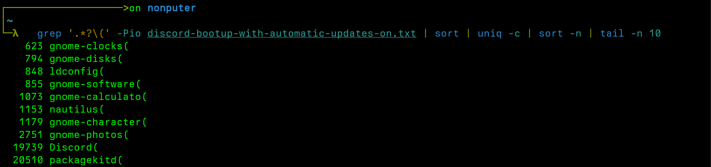
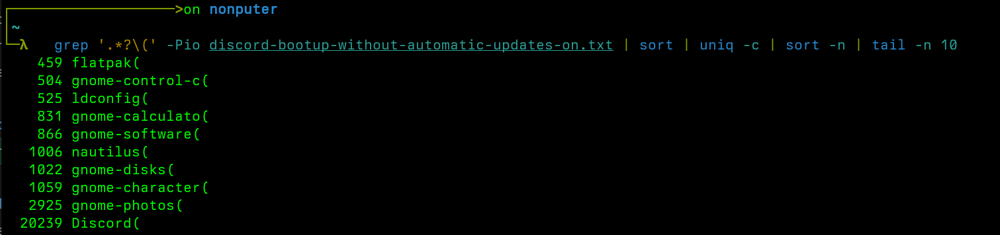

# What?
|||
|---|---|
| Distro | Fedora Workstation 38 |
| Desktop Environment | GNOME 44.5 |
| Resource manager | [Resources](https://github.com/nokyan/resources) |

I was experiencing minor hiccups in the system with frequent `Application not responding` popups. I looked at system resources, high `/home` disk usage. I have my home partition on a dying hdd and `/` on ssd.

# How?
I found [fatrace](https://manpages.ubuntu.com/manpages/xenial/man1/fatrace.1.html) by querying [phind](phind.com).

I run fatrace without any commands and log it to a file. I group the processes with
`grep '.*?\(' -Pio diskusage.txt | sort | uniq -c | sort -n`

The top applications were
- Firefox (obvious since I was using firefox)
- restorecon(no idea what this is)
- gnome-software(why does gnome-software make alot of file access?)

## Interrogating
### Firefox
Since firefox was the heaviest application running, the file access calls made sense.

### restorecon
I found out `restorecon` is a selinux specific utility. On a high level it manages file attributes for security purposes. I looked at the files it was accessing and it was [firefox-gnome-theme](https://github.com/rafaelmardojai/firefox-gnome-theme) files.

I had installed `firefox-gnome-theme` but after experiencing bad slowdowns from firefox, I uninstalled it from the directory following the uninstalling guide on their page. But the theme files were still present for the default profile and restorecon was accessing those files. I do not know if `firefox-gnome-theme` is the cause of high disk io. But after enabling it, I immediately started to experience `Application not responding` popups. I believed it was definitely the theme which caused slowdowns.

### GNOME Software
I tried running fatrace with and without automatic updates on and heres the results.

Theres definitely alot of packagekitd file access with automatic updates on. I did not run any applications except discord. Now I have no idea as to how often these update checks are made.

I made a mistake of not isolating my tests so I had another round of testing with the following parameters
- With `firefox-gnome-theme` installed
- With `firefox-gnome-theme` removed
- With `Automatic Updates` on
- With `Automatic Updates` off

I did not notice any stutter with automatic updates off and gnome theme installed. I looked about gnome software experience on reddit and people generally find it slow.

For now the result is inconclusive. I am going to be logging my experience over the coming days to narrow down the issue to one of these.
